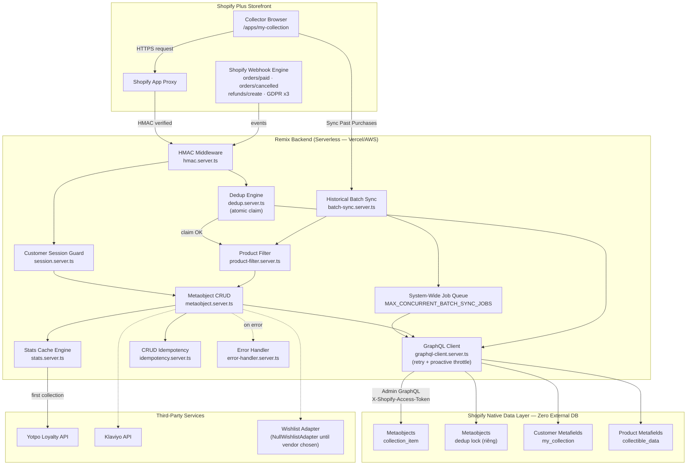

# tech-lead-spec.md — Downies "My Collection": Technical Specification

> Đây là tài liệu kỹ thuật đầy đủ, được `AGENTS.md` và `PROJECT-CONTEXT.md` tham chiếu tới bằng tên file này. Nếu có mâu thuẫn giữa các file, tài liệu này là nguồn sự thật cho kiến trúc & spec kỹ thuật; `AGENTS.md` là nguồn sự thật cho quy tắc code; `PROJECT-CONTEXT.md` là bản tóm tắt nhanh dùng hàng ngày.

**Client**: Downies | **Platform**: Shopify Plus | **ET đã duyệt**: 170h MVP Scope
**Architecture**: Shopify Native Data Layer (Metaobjects + Metafields — 0 External DB)

---

## 1. Executive Summary & Business Context

Downies là nhà bán lẻ numismatic (tiền xu, huy chương sưu tầm) vận hành trên Shopify Plus. Tính năng "My Collection" giải quyết vấn đề cốt lõi của nhà sưu tầm: theo dõi, quản lý, ghi nhận giá trị bộ sưu tập coin cá nhân — tăng retention, tạo điểm chạm cross-sell, tích hợp loyalty.

**Scale**: 500–5,000+ collector khi launch; 20,000+ trong 12 tháng; tối đa ~1,000 items/user.

### 1.1 Cost Ownership (Contractual Baseline)

| Loại chi phí | Trong 170h? | Ai trả |
|---|---|---|
| Giờ công dev/QA/PM/Tech Lead | Có | Downies trả cho đơn vị phát triển |
| Hosting (Vercel/AWS), domain, SSL | Không | Downies đứng tên & thanh toán trực tiếp |
| Yotpo, Klaviyo, Wishlist vendor fee | Không | Downies (subscription riêng) |

Kiến trúc 100% Shopify Native — không Redis, không DB ngoài — nên không phát sinh chi phí SaaS dữ liệu bổ sung.

### 1.2 Core Assumptions (không tự ý đổi)

1. **Data source**: 100% Shopify GraphQL API + Webhook `orders/paid`. ERP là CR riêng (ROM +25–40h), báo giá chính xác sau khi có API spec ERP thật.
2. **Valuation**: `current_market_value` là Collector's Declared Value — user tự nhập. Không tích hợp pricing API/AI tự động.
3. **Wishlist vendor**: TBD — dùng Interface Adapter Pattern để cô lập UI khỏi vendor logic cụ thể.

### 1.3 Non-Functional Requirements

- **Performance**: Dashboard load nhanh nhờ đọc từ cached Customer Metafields; phân trang cursor-based cho collection lớn.
- **Scalability**: chịu tải 20,000+ collectors, không vọt CPU/Memory nhờ caching.
- **Security & Isolation**: 100% request qua App Proxy/Webhook phải qua HMAC SHA-256; 100% customer data isolation — có test cụ thể chứng minh (không chỉ tin code).
- **Accessibility**: WCAG 2.1 AA best-effort (semantic HTML5, ARIA, keyboard nav cơ bản) — không cần audit độc lập.

### 1.4 Out-of-Scope trong MVP

ERP active sync execution · Native mobile apps · Automated real-time market valuation API · P2P coin trading marketplace · Professional grading service verification (PCGS/NGC) · Valuation-linked insurance integration · Multi-currency conversion (mặc định AUD) · PDF/print portfolio export.

---

## 2. System Architecture



**Ghi chú đọc sơ đồ**: mũi tên liền = luồng chính (data/control flow); mũi tên đứt = tích hợp phụ/non-blocking. `Dedup lock` được tách thành metaobject type riêng, không chung với `collection_item` (xem mục 2.2 và 3.2). `Queue` (system-wide job limit) nằm giữa Batch Sync và GraphQL Client để chặn tình huống nhiều customer cùng sync làm vọt Leaky Bucket chung của shop (xem mục 2.4).

<details>
<summary>Bản ASCII fallback (nếu môi trường không render Mermaid)</summary>

```
Browser/Storefront Collector
        |  HTTPS /apps/my-collection
        v
Shopify App Proxy  ---(HMAC verified)--->  Remix Backend (serverless)
                                                  |          |
                                          Admin GraphQL   REST Integration
                                                  v               v
                                    Shopify Native Data Layer   Third-Party
                                    - Metaobjects               - Yotpo Loyalty
                                    - Dedup Lock (riêng)        - Klaviyo
                                    - Customer/Product Metafields - Wishlist Adapter
```

</details>

### 2.5 Directory Structure

```text
app-shopify/
├── app/
│   ├── config/
│   │   └── constants.ts                # Single source of truth — mọi limit/threshold/timeout (mục 7)
│   ├── lib/
│   │   ├── hmac.server.ts              # HMAC verify: App Proxy (query params) + Webhook (raw body)
│   │   ├── session.server.ts           # Extract customer_id từ App Proxy request, redirect nếu chưa login
│   │   ├── graphql-client.server.ts    # Admin GraphQL wrapper: retry/backoff + proactive throttle + cost log
│   │   ├── dedup.server.ts             # claimOrderSync() — atomic claim qua metaobjectCreate + catch userErrors
│   │   ├── metaobject.server.ts        # CRUD collection_item — CHỈ nơi duy nhất đọc/ghi metaobject này
│   │   ├── metafield.server.ts         # CRUD Customer/Product Metafields (stats cache, collectible_data)
│   │   ├── stats.server.ts             # recalculateAndCacheStats() — tính lại total_items/total_value
│   │   ├── product-filter.server.ts    # filterCoinLineItems() — coin vs accessory classifier
│   │   ├── batch-sync.server.ts        # Historical Batch Sync engine (lookback + max orders + concurrency)
│   │   ├── idempotency.server.ts       # CRUD manual idempotency_key cache
│   │   ├── error-handler.server.ts     # AppError class + withErrorHandler() wrapper cho mọi route action/loader
│   │   ├── logger.server.ts            # Structured JSON logger, auto-redact PII trong log
│   │   ├── queue.server.ts             # System-wide ACTIVE_BATCH_SYNC_JOBS counter (mục 2.4)
│   │   ├── integrations/
│   │   │   ├── yotpo.server.ts         # awardLoyaltyPoints() — non-blocking, catch riêng
│   │   │   ├── klaviyo.server.ts       # Sync customer vào segment
│   │   │   └── wishlist-adapter.ts     # Interface + NullWishlistAdapter (no-op cho đến khi chốt vendor)
│   │   └── validation/
│   │       └── schemas.ts              # Zod schemas cho mọi request body (POST/PUT)
│   ├── routes/                         # 1 file = 1 route, đặt tên theo path (React Router v7 convention)
│   │   ├── api.collection.tsx                    # GET list / POST manual add
│   │   ├── api.collection.$item_id.tsx           # PUT update / DELETE soft-delete
│   │   ├── api.collection.$item_id.wishlist.tsx  # POST/DELETE toggle wishlist
│   │   ├── api.collection.stats.tsx              # GET fast-path stats
│   │   ├── api.collection.sync.tsx                # POST trigger historical sync
│   │   ├── api.webhooks.orders-paid.tsx
│   │   ├── api.webhooks.orders-cancelled.tsx
│   │   ├── api.webhooks.refunds-create.tsx
│   │   ├── api.webhooks.customers-data-request.tsx   # GDPR
│   │   ├── api.webhooks.customers-redact.tsx         # GDPR
│   │   ├── api.webhooks.shop-redact.tsx              # GDPR
│   │   └── app.my-collection.tsx                 # Dashboard FE page (loader fetch data, component render)
│   ├── components/
│   │   ├── dashboard/                  # StatsCards, CollectionGrid, CollectionList
│   │   ├── forms/                      # AddEditModal, DeleteConfirmModal
│   │   ├── filters/                    # FilterBar, SortDropdown
│   │   ├── layout/                     # Shell, Header, Nav
│   │   └── ui/                         # Button, Toast, Spinner — pure presentational, no business logic
│   ├── hooks/
│   │   ├── useCollection.ts            # Fetch + local state cho collection items
│   │   ├── useFilters.ts               # Sync filter state <-> URL params
│   │   └── useToast.ts                 # ⚠️ Phải dùng context/global store, KHÔNG tách instance độc lập mỗi component (lỗi đã gặp: toast không hiển thị vì state bị cô lập)
│   ├── styles/
│   │   ├── tokens.css                  # Design tokens (màu, spacing, typography)
│   │   └── collection.css
│   └── types/
│       └── index.ts                    # CollectionItem, CollectionFilters, ShopifyOrderWebhookPayload, ShopifyLineItem...
├── scripts/
│   └── setup-metafields.ts             # Chạy Ngày 1: tạo Metaobject/Metafield definitions + namespace collision check
├── tests/
│   └── unit/
│       ├── hmac.test.ts
│       ├── dedup.test.ts
│       ├── product-filter.test.ts
│       ├── stats.test.ts
│       ├── idempotency.test.ts
│       ├── batch-sync.test.ts
│       ├── batch-sync-integration.test.ts     # 200-order scale test, đo concurrency/timing thật
│       └── customer-isolation.test.ts         # ⚠️ Bắt buộc — xem AGENTS.md Known Pitfalls #6
├── docs/
│   ├── tech-lead-spec.md               # File này
│   ├── architecture-overview.md        # Cập nhật mỗi khi đổi kiến trúc (xem AGENTS.md mục 5)
│   └── wbs-et-breakdown.md
├── .env.example
├── AGENTS.md
├── PROJECT-CONTEXT.md
└── vitest.config.ts
```

**Nguyên tắc tổ chức**:
- `app-shopify/app/lib/*.server.ts` — mỗi file 1 trách nhiệm rõ ràng, không có file "utils.ts" chứa tạp nham nhiều thứ không liên quan.
- `metaobject.server.ts` là **nơi duy nhất** được phép gọi GraphQL để đọc/ghi `collection_item` — route/component khác không tự viết query riêng, luôn gọi qua module này (dễ audit, dễ sửa 1 chỗ).
- Route files (`app-shopify/app/routes/`) chỉ nên chứa: parse request → gọi hàm ở `lib/` → format response. **Không viết business logic trực tiếp trong route** — logic thật nằm ở `lib/`, route chỉ là lớp mỏng kết nối HTTP với logic.


- **App Proxy & Webhook verification**: HMAC-SHA256 dùng `SHOPIFY_APP_SECRET`. App Proxy: sort query params alphabet, tính HMAC, so sánh bằng `timingSafeEqual`. Webhook: HMAC tính trên raw body (base64), header `x-shopify-hmac-sha256`.
- **Admin GraphQL calls**: dùng access token riêng `SHOPIFY_ADMIN_ACCESS_TOKEN`, header `X-Shopify-Access-Token`. **Đây là 2 secret khác nhau, không dùng lẫn** — lỗi này đã từng xảy ra ở lần build trước (xem `AGENTS.md` mục 4.5).

### 2.2 Deduplication Strategy — Native Metaobject, không Redis

- Chống trùng theo `external_order_id` qua metaobject riêng cho lock (type riêng, tách khỏi `collection_item`), handle chuẩn hoá `dedup-{customer_id}-{order_id}`.
- **Chiến lược đúng (atomic thật)**: gọi thẳng `metaobjectCreate` để "claim" order, bắt lỗi `userErrors` chứa `taken`/`already` để phát hiện trùng — không phải query-trước-rồi-tạo (`metaobjectByHandle` trước) vì cách đó vẫn có race condition thật giữa lúc check và lúc tạo.
- Đánh giá độ tin cậy: Shopify chỉ retry webhook khi timeout (>5s) hoặc lỗi 5xx, không bắn song song dồn dập — nên cơ chế native atomic-create-and-catch đạt độ tin cậy cao mà không cần Redis.

### 2.3 Rate Limiting — Shopify Cost-Based Leaky Bucket

- Admin GraphQL: 5,000 cost points capacity, leak rate 50 points/giây.
- **2 lớp phòng thủ bắt buộc**:
  1. **Reactive**: khi gặp HTTP 429 hoặc extension `THROTTLED`, delay theo công thức `GRAPHQL_RETRY_BASE_DELAY_MS * 2^attempt`, tối đa `GRAPHQL_MAX_RETRY_ATTEMPTS` lần.
  2. **Proactive**: sau mỗi response, đọc `extensions.cost.throttleStatus.currentlyAvailable`. Nếu thấp hơn ngưỡng an toàn (`actualQueryCost * 2`), chủ động sleep để bucket hồi điểm trước khi bắn request tiếp — tránh bị Shopify từ chối ngay từ đầu thay vì chỉ phản ứng sau khi bị từ chối.
- Client App Proxy: giới hạn 60 requests/phút/IP.

### 2.4 Cross-Customer System-Wide Throttling

`BATCH_SYNC_CONCURRENCY` chỉ giới hạn concurrency **trong 1 job** của 1 customer — không ngăn được nhiều customer cùng bấm Sync cùng lúc. Cần duy trì bộ đếm toàn hệ thống `ACTIVE_BATCH_SYNC_JOBS` (in-memory, cấp-instance vì kiến trúc serverless — chấp nhận trade-off này trong 170h) giới hạn bởi `MAX_CONCURRENT_BATCH_SYNC_JOBS`. Job vượt ngưỡng → trạng thái "queued", không reject thẳng, không để GraphQL tự bắn throttle không kiểm soát.

---

## 3. Database Schema

### 3.1 Metaobject `collection_item`

| Field | Type | Ví dụ | Ghi chú |
|---|---|---|---|
| `item_id` | Text | `item_8f9a2b1c` | UUID v4, immutable |
| `product_id` | Text | `gid://shopify/Product/123456` | |
| `sku_code` | Text | `COIN-2026-GOLD` | Mapping ERP sau này |
| `source` | Text | `shopify_sync`\|`erp_sync`\|`manual_entry` | |
| `external_order_id` | Text | `gid://shopify/Order/1001` | Dùng để upsert/dedup |
| `customer_id` | Text | `gid://shopify/Customer/...` | **Bắt buộc giữ lại khi map dữ liệu ra — dùng để tự defense-in-depth kiểm tra cách ly dữ liệu, không chỉ dựa vào query filter** |
| `quantity_owned` | Integer | 1 | ≥1, max 999 |
| `date_added_to_collection` | Date | auto-set | |
| `purchase_date` | Date | | |
| `purchase_price` | Decimal | 150.00 | |
| `current_market_value` | Decimal | 180.00 | Collector's Declared Value |
| `certificate_number` | Text | max 50 chars | |
| `user_grade` | Text | max 200 chars | |
| `user_notes` | Multi-line | max 500 chars | |
| `in_wishlist` | Boolean | | |
| `is_deleted` | Boolean | | Soft delete |

### 3.2 Metaobject dedup lock (riêng, tách khỏi `collection_item`)

Type riêng biệt, handle `dedup-{customer_id}-{order_id}`, fields: `customer_id`, `external_order_id`. Lý do tách riêng: `collection_item` không nên gánh 2 vai trò (chứa dữ liệu coin thật + đóng vai trò lock).

### 3.3 Customer Metafield `my_collection`

`total_items` (Integer, cached), `total_value` (Decimal, cached Σ current_market_value × quantity), `created_at` (Date), `last_updated` (Timestamp).

### 3.4 Product Metafield `collectible_data`

`erp_sku`, `denomination`, `country_of_issue`, `material`, `year_of_issue`, `issuer`, `quality`, `grade`, `limited_mintage`, `mintage_limit`.

**Trước khi tạo namespace, verify không xung đột** với app hiện tại trên Shopify Admin (Ngày 1, bắt buộc trước khi viết code). Fallback: `downies_collection`/`downies_product_data`.

---

## 4. Data Sync Flow

### 4.1 Real-time webhook `orders/paid`

1. Verify HMAC → 401 nếu sai.
2. `claimOrderSync()` atomic (mục 2.2) → nếu `false` (đã claim), early-return `200 OK`.
3. Fetch `collectible_data` metafield cho các `product_id` trong line items → build `collectibleProductIds` Set.
4. `filterCoinLineItems(lineItems, collectibleProductIds)` — **bắt buộc truyền đúng tham số thứ 2**, nếu không hàm sẽ chỉ nhận diện coin qua `productType` cứng, bỏ qua đường chính (metafield), dễ loại nhầm coin thật một cách âm thầm.
5. **Upsert theo `product_id`** (không phải luôn tạo mới): với mỗi coin line item, kiểm tra customer đã có item cùng `product_id` chưa — nếu có, `quantity_owned += lineItem.quantity`; nếu chưa, tạo record mới với `source: shopify_sync`, `external_order_id`.
6. Xử lý từng item độc lập (`Promise.allSettled`), lỗi 1 item không làm hỏng cả webhook.
7. Recalculate `total_items`/`total_value` → cache Customer Metafields.
8. Lần đầu tạo collection → Yotpo +50 điểm, non-blocking (`.catch()` riêng, không fail webhook nếu Yotpo lỗi).

### 4.2 Product Line Item Filtering

**Điều kiện GIỮ** (PASS nếu ANY đúng): có metafield `collectible_data` HOẶC `productType` khớp danh sách numismatic (`coins`, `medal`, `bullion`, `commemorative`...).

**Điều kiện LOẠI**: `productType` khớp danh sách accessory (`case`, `cleaning kit`, `album`, `supplies`...) HOẶC title/vendor chứa keyword accessory (`coin box`, `cleaning`, `postage`, `shipping`, `storage`...) HOẶC `product_id` null (shipping/fee lines).

**Áp dụng cho CẢ webhook real-time lẫn historical batch sync** — không chỉ 1 trong 2.

### 4.3 Order Lifecycle — Cancel & Refund

- `orders/cancelled`: huỷ toàn bộ → soft-delete item theo `external_order_id`; huỷ một phần → giảm `quantity_owned` tương ứng.
- `refunds/create`: trừ đúng số lượng coin bị refund, recalculate cached stats.

### 4.4 GDPR Mandatory Webhooks

`customers/data_request`, `customers/redact`, `shop/redact` — bắt buộc implement xử lý thật (export/redact dữ liệu), không để dạng TODO/stub.

### 4.5 Historical Batch Sync

- **Trigger**: user bấm "Sync Past Purchases" lần đầu / thủ công.
- **Giới hạn**: `HISTORICAL_SYNC_LOOKBACK_YEARS` (mặc định 3 năm) HOẶC `HISTORICAL_SYNC_MAX_ORDERS` (mặc định 200 đơn), tuỳ điều kiện đến trước. **Đổi giá trị này phải đồng bộ ở TẤT CẢ nơi**: constant, GraphQL query filter, banner UX copy FE, test case biên — không chỉ đổi 1 chỗ.
- **Banner UX khi chạm trần**: *"Hệ thống đã tự động đồng bộ các đơn hàng trong [N] năm gần nhất (tối đa [M] đơn). Đối với các đồng xu mua trước thời gian này, quý khách vui lòng thêm thủ công qua biểu mẫu Thêm đồng xu mới."*
- **Tối ưu hiệu năng**:
  1. Filter tại query level (`created_at`, `financial_status:paid`).
  2. Product classifier loại phụ kiện trước khi xử lý.
  3. Gộp nhiều mutation vào 1 HTTP payload bằng GraphQL alias (giảm round-trip network) — **dùng `variables`, không string-interpolate trực tiếp giá trị user-input** (rủi ro GraphQL injection với các field tự do như `user_notes`).
  4. Concurrency giữa nhiều order/payload (không chỉ trong 1 order) + proactive rate limiting.
  5. Exception isolation: lỗi 1 item trong payload alias không làm hỏng các item khác — map đúng lỗi về đúng item qua tên alias.
- **Khuyến nghị kiến trúc dài hạn**: chuyển sang mô hình async — trả về ngay trạng thái "đang đồng bộ", xử lý nền, FE polling tiến độ qua 1 Customer Metafield tạm (`sync_status`, `sync_progress`) — thay vì cố giữ toàn bộ quá trình trong 1 request-response đồng bộ bên trong giới hạn timeout App Proxy (thường ~10s). Ngay cả sau tối ưu, thời gian chạy thực tế (tính cả throttle retry thật) có xu hướng dao động sát ngưỡng timeout — margin an toàn mỏng nếu vẫn giữ mô hình đồng bộ.

### 4.6 ERP-Ready Design (không thực thi trong MVP)

Schema có sẵn field (`sku_code`, `source: erp_sync`) để mở rộng, nhưng **không code endpoint `/api/webhooks/erp-orders` thật** trong scope 170h.

---

## 5. API Specification

| Method | Endpoint | Ghi chú |
|---|---|---|
| GET | `/api/collection` | List + `total_items`/`total_value`. Filter theo `customer_id` server-side. |
| POST | `/api/collection` | Manual add → 201. Cần `idempotency_key`. |
| PUT | `/api/collection/:item_id` | Update → 200. Cần `idempotency_key`. |
| DELETE | `/api/collection/:item_id` | Soft delete → 204. |
| POST | `/api/collection/sync` | Trigger historical batch sync. |
| POST | `/api/collection/:item_id/wishlist` | Toggle wishlist flag qua Adapter. |
| POST | `/api/webhooks/orders-paid` | Real-time sync. |
| POST | `/api/webhooks/orders-cancelled` | Cancel handling. |
| POST | `/api/webhooks/refunds-create` | Refund handling. |
| POST | `/api/webhooks/customers-data-request` | GDPR. |
| POST | `/api/webhooks/customers-redact` | GDPR. |
| POST | `/api/webhooks/shop-redact` | GDPR. |

### 5.1 CRUD Idempotency (Manual Entry)

FE sinh `idempotency_key` (UUID) mỗi lần mở form Add/Edit, gửi kèm trong body. Backend check key này (cache ngắn hạn cấp-instance, TTL vài phút) — nếu đã xử lý, trả kết quả cũ thay vì tạo/sửa lần 2. FE cũng tự disable nút Submit ngay sau lần bấm đầu (client-side debounce) làm lớp phòng thủ đầu tiên.

---

## 6. Frontend Requirements

Dashboard "My Collection" — stats cards (total items/value), grid/list view (AJAX, pagination/lazy-load cho 50+ items), filter/sort (denomination, country, material, year, grade, issuer — giữ state qua URL params), modal Add/Edit (validation đầy đủ), delete flow (double confirmation modal), responsive mobile/tablet, WCAG 2.1 AA best-effort, banner UX cho lookback limit.

---

## 7. Constants (`app-shopify/app/config/constants.ts`)

| Constant | Giá trị đề xuất |
|---|---|
| `HISTORICAL_SYNC_LOOKBACK_YEARS` | 3 |
| `HISTORICAL_SYNC_MAX_ORDERS` | 200 |
| `MAX_QUANTITY_OWNED` | 999 |
| `MAX_CERTIFICATE_NUMBER_LENGTH` | 50 |
| `MAX_USER_GRADE_LENGTH` | 200 |
| `MAX_USER_NOTES_LENGTH` | 500 |
| `LOYALTY_SIGNUP_BONUS_POINTS` | 50 |
| `APP_PROXY_RATE_LIMIT_PER_MINUTE` | 60 |
| `GRAPHQL_BUCKET_CAPACITY` | 5000 |
| `GRAPHQL_LEAK_RATE_PER_SECOND` | 50 |
| `GRAPHQL_RETRY_BASE_DELAY_MS` | 500 |
| `GRAPHQL_MAX_RETRY_ATTEMPTS` | 5 |
| `BATCH_SYNC_CONCURRENCY` | 5 |
| `MAX_CONCURRENT_BATCH_SYNC_JOBS` | 10 |
| `COLLECTION_PAGE_SIZE` | 50 |

---

## 8. Risk Matrix

| Risk | Probability | Impact | Mitigation |
|---|---|---|---|
| Data Source Ambiguity (ERP vs Shopify) | High | High | Schema ERP-Ready sẵn; CR riêng nếu cần ERP |
| Large Collection Performance (1k items/20k users) | Med-High | High | Cursor pagination, cache stats, lazy-load ảnh, test với mock 1,000 items |
| Wishlist Vendor chưa chọn | Med | Med | Interface Adapter Pattern, ẩn UI nếu trễ |
| Credential chậm (Yotpo/Klaviyo) | Med | Med | Mock Services Layer |
| Mobile Safari Cookie (App Proxy session) | Med | Med | `SameSite=None; Secure; HttpOnly` |
| Batch Sync timeout dưới tải thật | Med | High | Xem mục 4.5 — proactive throttle + cân nhắc chuyển async |
| Customer data leakage qua query filter sai | Low-Med | Rất cao | Test bắt buộc với 2 customer khác nhau (xem `AGENTS.md` 4.5 điểm 6) |

---

## 9. Open Questions & Deadlines

| # | Câu hỏi | Deadline | Mặc định nếu trễ |
|---|---|---|---|
| 1 | Data source: Shopify hay ERP? | Ngày 2, Tuần 1 | Shopify; ERP là CR riêng (+25-40h ROM) |
| 2 | Wishlist vendor cụ thể? | Ngày 3, Tuần 1 | Ẩn UI Wishlist, bổ sung bản vá sau |
| 3 | Staging keys Yotpo/Klaviyo? | Ngày 3, Tuần 1 | Dùng Mock Services |
| 4 | Namespace collision check | Ngày 1, Tuần 1 (bắt buộc trước code) | Fallback `downies_collection`/`downies_product_data` |
| 5 | Delete: hard hay soft? | Ngày 2, Tuần 1 | Soft delete |
| 6 | Hosting platform? | Ngày 4, Tuần 1 | Vercel/AWS App Runner |
| 7 | Downies đứng tên hosting account? | Ngày 4, Tuần 1 | Dev hỗ trợ tạo, chuyển owner trước go-live |
| 8 | Lookback boundary 3 năm/200 đơn có đúng ý Downies? | Ngày 2, Tuần 1 | Áp dụng mặc định 3 năm/200 đơn |

---

## 10. Execution Checklist (4 phase)

**Phase 1 — Setup (Tuần 1)**: chốt Open Questions, verify namespace, khởi tạo repo, tạo Metafield/Metaobject definitions, đăng ký App Proxy + webhook topics.

**Phase 2 — Core Dev (Tuần 2–3)**: HMAC middleware, dedup atomic engine, historical batch sync, webhook handlers, code review 100% PRs, mock services cho integrations.

**Phase 3 — QA & Security (Tuần 4)**: HMAC forgery/CSRF/data-leakage test, leaky bucket + backoff test, webhook retry/dedup test, E2E + performance test với mock 1,000 items.

**Phase 4 — Handover (Tuần 5)**: UAT, App Proxy production config, smoke test E2E, bàn giao mã nguồn.

**Phase 5 — Staging Verification (bắt buộc, trước Phase 4 hoàn tất go-live)**: Chạy trên Shopify dev store thật (không phải mock) tối thiểu các mục sau, có bằng chứng cụ thể (screenshot/log thật, không phải mô tả bằng lời):
- Auth Admin GraphQL với `SHOPIFY_ADMIN_ACCESS_TOKEN` thật — gọi được ít nhất 1 query/mutation thành công.
- GraphQL alias batching thật — gửi 1 payload gộp N-alias lên Shopify thật, xác nhận không chạm giới hạn max query complexity/max aliases của Shopify, và cost trả về (`extensions.cost`) khớp với tính toán cộng dồn dự kiến (xem `AGENTS.md` Known Pitfalls #10).
- Customer data isolation — tạo tối thiểu 2 customer test trên dev store, mỗi người có item riêng, gọi API cho từng customer và xác nhận không lẫn dữ liệu.
- Webhook thật — trigger 1 order thật (hoặc dùng Shopify CLI webhook trigger) thay vì chỉ giả lập payload trong test, xác nhận toàn bộ luồng dedup → filter → upsert → stats → loyalty chạy đúng.
- Batch sync với dataset thật (không cần đủ 200 đơn, nhưng tối thiểu vài chục đơn) — đo thời gian thực tế, so sánh với benchmark mock.

## 11. Quyết định cần Downies/PM duyệt (không phải quyết định kỹ thuật thuần)

- **Mô hình Batch Sync đồng bộ vs bất đồng bộ** (mục 4.5): dù đã tối ưu nhiều lớp (alias batching, concurrency, proactive throttle), thời gian chạy thực tế của mô hình đồng bộ hiện tại vẫn dao động sát ngưỡng timeout App Proxy khi tính đúng chi phí throttle retry thật — margin an toàn mỏng. Chuyển sang mô hình bất đồng bộ (progress polling) loại bỏ rủi ro này hoàn toàn nhưng đổi lại UX khác (progress bar thay vì chờ 1 lần) và có thể phát sinh thêm giờ công ngoài ước tính ban đầu. Đây là đánh đổi UX + chi phí, cần Downies/PM xác nhận hướng đi, không nên để dev tự quyết một mình.
